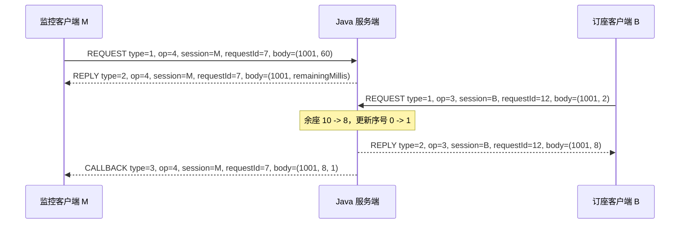

# SC6103 接口与数据类型规范 v1.0

更新日期：2026-10-06  
适用方案：Java 服务端 + Python 客户端，UDP/IPv4，三人小组 A/B/C。  
状态：开发规范；业务代码和端到端系统尚未实现。本文的字节样例单独做过 Java/Python 核对，不能代替系统验收。

## 1. 适用范围与执行原则

本文在《SC6103_项目指南与三人分工》的基础上，固定跨语言报文、数据类型、模块接口及处理顺序。本文使用“必须”表示本组实现必须遵守的约定，不表示该细节由老师指定。课程要求仍以课程文件为准。

**涉及接口、字段、线格式和处理边界时，以本文为唯一实现依据。**原分工文档中的协议表是早期草案；不得混用其中的 30 字节头部、可选 callback 字段或“确认后重新计完整监控秒数”的约定。分工、提交日期和报告安排仍见原指南。

本次固定的决策：

| 项目 | v1.0 决策 |
|---|---|
| 开发基线 | Java 17；Python 3.10 或以上，客户端避免使用高于 3.10 的专属语法 |
| 传输 | UDP/IPv4；一个数据报是一条完整消息，不分片、不拼接多个消息 |
| 字节序 | 全部多字节数值采用大端；没有隐式对齐和填充 |
| 公共头部 | 32 字节，新增 semantics 与 reserved 各 1 字节 |
| 票价 | IEEE 754 binary32，币种固定 SGD |
| 起飞时间 | 年、月、日、时、分共五个 i32，固定 UTC+8 |
| 字符串 | i32 UTF-8 字节长度 + UTF-8 内容 |
| 消息上限 | 1024 字节，包含 32 字节头部；这是应用限制 |
| 回调 | 字段全部固定；用原监控注册请求的身份关联订阅 |
| 监控确认 | 返回 remainingMillis，单位毫秒；重放时重新计算剩余时间，不重新注册 |
| 去重 | AMO 按 (clientSessionId, requestId) 保存请求历史；保留到服务端进程结束 |

本文是首个供实现使用的线协议，头部 version=1。早期 30 字节草案没有兼容承诺。后续不兼容修改必须提升 version，并同时更新两端与测试向量。

## 2. 基础类型及边界

### 2.1 线类型与语言映射

| 记号 | 长度 | 线表示 | Java | Python |
|---|---:|---|---|---|
| u8 | 1 | 无符号 0..255 | 读取为 int | int |
| u16 | 2 | 无符号 0..65535，大端 | 读取为 int | int |
| i32 | 4 | 有符号二进制补码，大端 | int | int，编码前限制在 -2147483648..2147483647 |
| f32 | 4 | IEEE 754 binary32，大端 | float | float，经单个 binary32 转换后传输 |
| session128 | 16 | UUID 的原始 16 字节 | UUID，高 64 位后低 64 位，每部分大端 | uuid.UUID.bytes，禁止 bytes_le |
| str | 4+N | i32 N 后跟 N 个 UTF-8 字节，无 NUL 终止符 | String | str |
| FlightTime | 20 | year、month、day、hour、minute，均为 i32 | FlightTime | FlightTime |

字符串长度 N 不允许为负；解码必须先检查 N 不超过本字段上限和报文剩余字节。UTF-8 编解码必须严格检查非法序列，不允许静默替换为问号或替代字符。基础 str 编解码支持空字符串；具体业务再判断是否允许为空。

Java 整数恢复时对单字节使用 `& 0xff`，不得把有符号 byte 直接向高位扩展。浮点使用 `Float.floatToIntBits` / `Float.intBitsToFloat` 做位模式转换，再自己按大端读写这些位。Python 整数使用显式宽度和字节序；浮点允许仅用 `struct.pack('>f', value)` / `struct.unpack('>f', raw)` 做基础表示转换，其余字段顺序、拼接和边界检查由项目代码完成。

不得使用 Java 对象序列化、Java 输入/输出流类或现成 RPC 框架完成通信及编解码。上述基础转换 API 是本组实现选择，不代表课程逐项批准过某个 API。

### 2.2 字段约束

| 字段 | 约束 |
|---|---|
| flightId | 1..2147483647 |
| availableSeats | 0..2147483647 |
| quantity | 1..2147483647，且不大于当前余座 |
| source、destination | 每项编码后最多 128 字节；去除两端 U+0020 空格后不得为空 |
| 地点比较 | 仅去除两端 U+0020 空格，然后区分大小写精确比较；不做 Unicode 归一化 |
| year/month/day/hour/minute | 年 1..9999；完整日期有效；时 0..23、分 0..59；秒固定 0；UTC+8 |
| airfare、newPrice | 有限、非负 binary32；负零在业务存储及成功回复中规范为正零 |
| delta | 有限且大于 0 的 binary32；相加后的结果必须有限且大于原价 |
| durationSeconds | 1..3600；请求中的监控时长单位为秒 |
| remainingMillis | 0..3600000；回复中剩余时长单位为毫秒，0 表示登记已无有效时间 |
| updateSequence | 每个航班独立维护；初值 0；实际成功订座后加一；callback 中为 1..2147483647 |
| requestId | 1..2147483647；同一 session 内不复用；达到上限后结束旧会话再新建会话 |
| 错误说明 | 最多 256 个 UTF-8 字节，非空；客户端判断结果必须使用 status |
| 航班数据集 | 首版最多 100 班；启动时校验 ID 唯一、地点及其余字段合法 |

所有数值校验以线上实际传输的值为准。Python 输入先转为 binary32 再校验业务范围；超出 binary32 范围要显示输入错误，不能让打包异常结束客户端。Java 的票价加法结果按 float 存储；显示可保留两位小数，但不得在业务层额外隐式四舍五入。极小 delta 若舍入后不能增加票价，返回参数非法。

updateSequence 达到上限后，不允许回绕；继续订座返回 LIMIT_EXCEEDED，余座保持不变。查询结果按 flightId 升序返回。最多 100 个 ID 的结果不超过本协议消息上限。

## 3. 32 字节公共头部

偏移从数据报第一个字节开始计数；没有 magic 或额外前导字节。

| 偏移 | 字段 | 类型 | 长度 | 规则 |
|---:|---|---|---:|---|
| 0 | version | u8 | 1 | 固定 1 |
| 1 | messageType | u8 | 1 | 1=REQUEST，2=REPLY，3=CALLBACK |
| 2 | operation | u16 | 2 | 1..6 为已定义操作 |
| 4 | clientSessionId | session128 | 16 | 客户端启动时生成 UUID v4，整个进程使用同一值 |
| 20 | requestId | i32 | 4 | 新逻辑请求递增；重传保持不变 |
| 24 | status | u16 | 2 | REQUEST/CALLBACK 必须为 0；REPLY 见错误码表 |
| 26 | semantics | u8 | 1 | 1=ALO，2=AMO |
| 27 | reserved | u8 | 1 | 固定 0，不携带尝试次数或标志 |
| 28 | bodyLength | i32 | 4 | 0..992，必须等于实际数据报长度减 32 |
| 32 | body | 操作相关 | 可变 | 只按本文定义的字段顺序解析 |

会话标识在解码时按完整 16 字节比较，不以字符串格式或本机 UUID 内存布局比较；全零 session 无效。requestId 不表示第几次发送，不能在重传时增加。

### 3.1 回复匹配和模式校验

- REPLY 必须原样带回 REQUEST 的 operation、clientSessionId、requestId 和 semantics。
- 服务端在执行业务、查询/写入请求历史之前检查请求 semantics 与启动模式一致。
- 不一致时返回 status=7；该错误回复的 semantics 仍回显客户端请求的值，说明文本指出服务端实际模式。客户端先完成身份匹配再显示错误。
- CALLBACK 的 semantics 使用服务端当前模式，operation 固定 4，身份使用该接收者的监控注册身份。
- 客户端只接收来自配置的服务端 IP/端口的消息。普通回复还必须匹配当前调用的 session、requestId、operation、semantics；不得仅凭 requestId 匹配。

### 3.2 数据报校验和失败分类

接收缓冲区采用 65535 字节，避免先截断为 1024 字节后误接收损坏报文；随后按本协议的 1024 字节上限检查。Java 仅解析 DatagramPacket 的实际 offset/length，Python 仅解析 recvfrom 返回的 bytes。

1. 长度不足 32、version 不支持、messageType 无效、session 全零、requestId 无效或 semantics 不在 1/2：记录并丢弃，不能构造可靠匹配的错误回复。
2. 对身份可识别的 REQUEST，reserved 非零、status 非零、长度不一致、负长度、非法 UTF-8、缺少字段或额外尾字节：返回 MALFORMED_MESSAGE，不执行业务。
3. 对身份可识别的 REQUEST，实际数据报超过 1024 字节：返回 LIMIT_EXCEEDED，不继续解析负载。
4. 未知 operation 返回 UNSUPPORTED_OPERATION，并在错误头部回显该原始操作码。未知操作的成功回复无效。
5. 格式有效但数值不符合业务规则，例如 quantity=-1：交给业务层返回 INVALID_ARGUMENT。这类业务失败参与 AMO 缓存。
6. 客户端收到畸形 REPLY/CALLBACK 时记录并丢弃，不向服务器发送“错误的回复”。无关或畸形消息不得刷新当前调用的等待截止时间。

前置格式/模式错误不进入业务历史；业务层返回的成功或失败都进入 AMO 历史。同一报文同时有多项错误时，不保证客户端收到哪项前置错误，唯一要求是不得改变业务状态。

### 3.3 完整消息的层次结构

本规范中的“消息”指传给 UDP send/sendto 的应用字节数组，以及 receive/recvfrom 返回的应用数据。IP/UDP 自身的头部由操作系统处理，不放进下面的 Header，也不计入本规范的 1024 字节上限。

```text
一条应用消息 = Header（固定 32 字节） + Body（bodyLength 字节）

应用数据报偏移：
0                                                   31 32              L-1
+-----------------------------------------------------+------------------+
|                     Header                          |       Body       |
+-----------------------------------------------------+------------------+
|                  固定 32 字节                        |    可变长度       |
+-----------------------------------------------------+------------------+

Header 按偏移展开：
  [0]       version:u8
  [1]       messageType:u8
  [2..3]    operation:u16
  [4..19]   clientSessionId:session128
  [20..23]  requestId:i32
  [24..25]  status:u16
  [26]      semantics:u8
  [27]      reserved:u8
  [28..31]  bodyLength:i32

L = 实际应用数据报总长度 = 32 + bodyLength
```

Header 不包含客户端 IP/端口、服务端 IP/端口、重试次数、JSON 字段名或 Java/Python 类名。地址由 UDP socket 提供，重试次数仅存在于本地状态和日志中。

变长字段也必须有确定边界：字符串先写字节长度再写内容，列表先写元素数量再写元素；不插入逗号、换行、NUL 或额外分隔符。一个数据报末尾就是本条消息的末尾，不再附加“结束标志”。

### 3.4 四种用途对应的消息结构

线上 messageType 只有 1、2、3 三个值；成功回复与错误回复同属 REPLY，通过 status 区分。

| 消息用途 | 方向 | messageType | status | operation | Body 选择规则 |
|---|---|---:|---:|---|---|
| 请求 | 客户端 -> 服务端 | 1 | 0 | 用户调用的 1..6 | 第 4 节对应 REQUEST 结构 |
| 成功回复 | 服务端 -> 发起请求的客户端 | 2 | 0 | 回显原请求操作码 | 第 4 节对应成功 REPLY 结构 |
| 错误回复 | 服务端 -> 发起请求的客户端 | 2 | 1..9 | 回显原请求操作码 | 所有操作统一为 ErrorBody，第 5.1 节 |
| 座位回调 | 服务端 -> 已登记的监控客户端 | 3 | 0 | 固定 4 | 固定 12 字节 CallbackBody，第 6.1 节 |

请求和普通回复用同一个 `(clientSessionId, requestId, operation)` 关联。回调使用**监控登记**的 session/requestId 和 operation=4；触发更新的订座请求属于另一条调用，可以来自另一个客户端。

业务成功回复已承担确认作用，v1 不另发 ACK 消息；也没有 HEARTBEAT、MONITOR_END 或 CALLBACK_ACK 消息类型。监控结束由约定的计时器判断。

### 3.5 消息体分派顺序

完成来源、头部、长度及当前调用身份检查后，按下列顺序选择消息体解码器：

```text
messageType=REQUEST:
    要求 status=0
    根据 operation 解析该操作的请求体

messageType=REPLY:
    status!=0 -> 只解析 ErrorBody，不按 operation 解析成功体
    status==0 -> 根据 operation 解析该操作的成功回复体

messageType=CALLBACK:
    要求 status=0、operation=4、bodyLength=12
    解析 flightId、availableSeats、updateSequence
```

例如 QUERY_FLIGHT 的错误回复虽然 operation=2，但 Body 是错误字符串，不能从偏移 32 开始读取起飞年份。解析后必须恰好消费 bodyLength 个字节；字段不足或留下尾字节都属于格式错误。

## 4. 六个操作与成功回复

下表中的字段严格按从左到右顺序编码；固定长度是 body 的长度，不包括公共头部。

| operation | 名称 | REQUEST body | 成功 REPLY body | 成功回复体长度 |
|---:|---|---|---|---:|
| 1 | QUERY_ROUTE | source:str，destination:str | count:i32，flightIds:count 个 i32 | 4+4×count |
| 2 | QUERY_FLIGHT | flightId:i32 | departure:FlightTime，airfare:f32，availableSeats:i32 | 28 |
| 3 | RESERVE_SEATS | flightId:i32，quantity:i32 | flightId:i32，availableSeats:i32 | 8 |
| 4 | MONITOR_SEATS | flightId:i32，durationSeconds:i32 | flightId:i32，remainingMillis:i32 | 8 |
| 5 | SET_AIRFARE | flightId:i32，newPrice:f32 | flightId:i32，airfare:f32 | 8 |
| 6 | INCREASE_AIRFARE | flightId:i32，delta:f32 | flightId:i32，airfare:f32 | 8 |

REQUEST body 长度：QUERY_ROUTE 可变，QUERY_FLIGHT 为 4，其余四个为 8。QUERY_ROUTE 的回复只写一次 count，不再给列表额外套一层数量。没有匹配航班返回错误，不返回成功的空列表。

QUERY_FLIGHT 的成功体不额外包含 flightId；调用方通过匹配的请求知道该 ID。不得擅自增加字段，否则 Java/Python 会从不同偏移读取时间和票价。

业务顺序：检查参数范围 -> 查找航班 -> 检查当前状态限制 -> 一次性修改 -> 生成结果。正常业务失败只返回错误，不扣座、不改价、不创建登记、不增加序号、不生成 callback。查询返回值必须是快照，不能让后续修改改变已缓存的结果。

SET_AIRFARE 是幂等的赋值操作；INCREASE_AIRFARE 是非幂等的累加操作。两者不生成座位 callback。RESERVE_SEATS 每次实际成功执行才扣减余座、递增 updateSequence，并为有效订阅生成事件。

以下按既定 v1 字段展开每种消息。**所有偏移均相对于完整应用数据报的第一个字节，Body 从 32 开始。**这里的长度前缀和列表 count 由 codec 生成/读取，不要求业务 DTO 重复保存。

### 4.1 QUERY_ROUTE：航线查询

请求头：messageType=1、operation=1、status=0。S/D 分别是出发地/目的地的 UTF-8 字节数。

| 偏移 | 字段 | 类型 | 字节数 |
|---|---|---|---:|
| 32 | sourceByteLength | i32 | 4 |
| 36 | sourceUtf8 | UTF-8 字节 | S |
| 36+S | destinationByteLength | i32 | 4 |
| 40+S | destinationUtf8 | UTF-8 字节 | D |

请求 bodyLength=8+S+D，总长度=40+S+D。示例 SIN -> PEK：S=3、D=3，bodyLength=14，总长度=46。

成功回复头：messageType=2、operation=1、status=0。N 为匹配的航班数，成功时为 1..100。

| 偏移 | 字段 | 类型 | 字节数 |
|---|---|---|---:|
| 32 | count | i32 | 4 |
| 36+4×i，i=0..N-1 | flightIds[i] | i32 | 每项 4 |

成功回复 bodyLength=4+4×N，总长度=36+4×N。示例 [1001, 1002]：bodyLength=12，总长度=44；整个列表前只有一个 count。

### 4.2 QUERY_FLIGHT：航班详情

请求头：messageType=1、operation=2、status=0；bodyLength=4，总长度=36。

| 偏移 | 请求字段 | 类型 | 字节数 |
|---:|---|---|---:|
| 32 | flightId | i32 | 4 |

成功回复头：messageType=2、operation=2、status=0；bodyLength=28，总长度=60。

| 偏移 | 成功回复字段 | 类型 | 字节数 |
|---:|---|---|---:|
| 32 | departure.year | i32 | 4 |
| 36 | departure.month | i32 | 4 |
| 40 | departure.day | i32 | 4 |
| 44 | departure.hour | i32 | 4 |
| 48 | departure.minute | i32 | 4 |
| 52 | airfare | f32 | 4 |
| 56 | availableSeats | i32 | 4 |

FlightTime 的五个整数直接展开，不额外添加“时间长度”。时区固定为 UTC+8，不再传时区字符串。

### 4.3 RESERVE_SEATS：订座

operation=3；请求与成功回复的 bodyLength 均为 8，总长度均为 40。

| 消息 | messageType | status | 偏移 | 字段 | 类型 | 字节数 |
|---|---:|---:|---:|---|---|---:|
| 请求 | 1 | 0 | 32 | flightId | i32 | 4 |
| 请求 | 1 | 0 | 36 | quantity | i32 | 4 |
| 成功回复 | 2 | 0 | 32 | flightId | i32 | 4 |
| 成功回复 | 2 | 0 | 36 | availableSeats | i32 | 4 |

例如请求 (1001, 2)，初始余座 10，成功体为 (1001, 8)。回复中的余座是该次执行后的值；AMO 重放返回该次历史结果，不重新读取之后的余座。updateSequence 不加入订座回复，出现在 callback 中。

### 4.4 MONITOR_SEATS：监控登记

operation=4；请求与成功回复的 bodyLength 均为 8，总长度均为 40。

| 消息 | messageType | status | 偏移 | 字段 | 类型 | 字节数 |
|---|---:|---:|---:|---|---|---:|
| 请求 | 1 | 0 | 32 | flightId | i32 | 4 |
| 请求 | 1 | 0 | 36 | durationSeconds | i32，秒 | 4 |
| 成功回复 | 2 | 0 | 32 | flightId | i32 | 4 |
| 成功回复 | 2 | 0 | 36 | remainingMillis | i32，毫秒 | 4 |

虽然请求和成功回复长度一样，但第二字段的单位不同。例：(1001, 60) 申请 60 秒；确认 (1001, 59000) 表示发送确认时剩余 59000 毫秒。后续更新使用 messageType=3 的独立 callback，不拼在本次确认体后面。

### 4.5 SET_AIRFARE：设置票价

operation=5；请求与成功回复的 bodyLength 均为 8，总长度均为 40。

| 消息 | messageType | status | 偏移 | 字段 | 类型 | 字节数 |
|---|---:|---:|---:|---|---|---:|
| 请求 | 1 | 0 | 32 | flightId | i32 | 4 |
| 请求 | 1 | 0 | 36 | newPrice | f32 | 4 |
| 成功回复 | 2 | 0 | 32 | flightId | i32 | 4 |
| 成功回复 | 2 | 0 | 36 | airfare | f32 | 4 |

请求 (1001, 120.0) 的 newPrice 编码为 `42 F0 00 00`，不是整数 120 的字节表示，也不是十进制字符串。成功回复返回设置后的实际票价。

### 4.6 INCREASE_AIRFARE：增加票价

operation=6；请求与成功回复的 bodyLength 均为 8，总长度均为 40。

| 消息 | messageType | status | 偏移 | 字段 | 类型 | 字节数 |
|---|---:|---:|---:|---|---|---:|
| 请求 | 1 | 0 | 32 | flightId | i32 | 4 |
| 请求 | 1 | 0 | 36 | delta | f32 | 4 |
| 成功回复 | 2 | 0 | 32 | flightId | i32 | 4 |
| 成功回复 | 2 | 0 | 36 | airfare | f32 | 4 |

请求 (1001, 20.0) 的 delta 编码为 `41 A0 00 00`。若原票价为 100.0，成功体为 (1001, 120.0)，第二字段返回新总票价，不回显增加金额。

### 4.7 消息长度速查

该表只列请求及成功回复；所有错误回复统一使用第 5.1 节的变长结构。

| operation | 请求 bodyLength / 总长度 | 成功回复 bodyLength / 总长度 |
|---:|---|---|
| 1 | 8+S+D / 40+S+D | 4+4×N / 36+4×N |
| 2 | 4 / 36 | 28 / 60 |
| 3 | 8 / 40 | 8 / 40 |
| 4 | 8 / 40 | 8 / 40 |
| 5 | 8 / 40 | 8 / 40 |
| 6 | 8 / 40 | 8 / 40 |

## 5. 错误码和错误体

当 status 非零时，body **仅包含一个 str message**，不混入成功体字段。业务判断依赖数值错误码，不依赖中文/英文说明是否完全相同。

| status | 常量名 | 使用场景 |
|---:|---|---|
| 0 | OK | 成功 |
| 1 | ROUTE_NOT_FOUND | 没有匹配航线 |
| 2 | FLIGHT_NOT_FOUND | 正整数 ID 对应的航班不存在 |
| 3 | INSUFFICIENT_SEATS | 合法订座数量大于当前余座 |
| 4 | INVALID_ARGUMENT | ID/数量/时长不合法、地点为空、票价不合法或增量舍入后无变化 |
| 5 | MALFORMED_MESSAGE | 可识别请求身份下的编码/长度/字段格式错误 |
| 6 | UNSUPPORTED_OPERATION | 未实现的操作码 |
| 7 | SEMANTICS_MISMATCH | 客户端和服务器模式不同 |
| 8 | REQUEST_ID_REUSE | AMO 中已有请求键被不同请求字节或不同源端点复用 |
| 9 | LIMIT_EXCEEDED | 报文/结果超长，或 updateSequence 达到上限 |

正常业务错误通过返回值表达，不通过抛出异常让 UDP 主循环崩溃。未预期的进程错误、崩溃和重启恢复不属于本版调用语义保证范围。

### 5.1 所有操作共用的错误消息结构

错误头：messageType=2、operation 回显请求值、status 为 1..9。E 为错误说明的 UTF-8 字节数，范围 1..256。

| 偏移 | 字段 | 类型 | 字节数 |
|---|---|---|---:|
| 24（头部） | status | u16 | 2，已计入 32 字节头部 |
| 32 | messageByteLength | i32 | 4 |
| 36 | messageUtf8 | UTF-8 字节 | E |

bodyLength=4+E，总长度=36+E。status 只在头部出现一次，不在 body 再写一份错误码，也不附带 flightId 或成功体。

例：QUERY_FLIGHT 请求失败，operation=2、status=2，错误说明 `Flight not found` 为 16 字节；bodyLength=20，总长度=52。失败订座也采用同样结构，不返回一份填 0 的“成功余座”。

## 6. 回调报文与监控生命周期

### 6.1 固定 callback 格式

```text
Header:
  version=1, messageType=3, operation=4
  clientSessionId=接收者注册监控时的 session
  requestId=接收者注册监控时的 requestId
  status=0, semantics=服务器模式, reserved=0, bodyLength=12
Body:
  flightId:i32
  availableSeats:i32
  updateSequence:i32
```

总长度固定 44 字节。**requestId 不是触发订座的客户端请求编号。**同一次座位更新发给不同订阅者时，body 可以相同，但头部身份可能不同。

| 完整应用数据报偏移 | 回调字段 | 类型 | 字节数 |
|---:|---|---|---:|
| 32 | flightId | i32 | 4 |
| 36 | availableSeats | i32 | 4 |
| 40 | updateSequence | i32 | 4 |

示例 body=(1001, 8, 1) 表示航班 1001 的余座为 8，本次座位状态版本为 1。updateSequence 是该航班的状态更新序号，既不是客户端 requestId，也不是 callback 发送重试次数。

客户端只有在 session、注册 requestId、flightId 和服务器来源都匹配当前登记时，才显示 callback。同一登记内只显示 updateSequence 大于已显示最大值的事件，避免重复或乱序更新使余座倒退。初始已显示序号为 0；callback 首次可能大于 1。

### 6.2 注册、替换与清理

- 同一 session/flightId 同时最多一条有效登记；不同 session 可同时监控同一航班。
- 登记保存源端点、session、注册 requestId、flightId、服务器单调时钟截止值。地址取自实际收到的 UDP 数据报。
- 新逻辑注册执行成功后替换该 session/flightId 的旧登记；旧注册身份此后不再接收更新。
- AMO 重传相同注册请求不重建或刷新登记；ALO 每次实际执行注册都会替换登记并重新计算截止时间。
- 服务端使用 `System.nanoTime()` 计算 `expiryNanos = nowNanos + durationSeconds * 1_000_000_000L`。单调时钟值只在本机使用，绝不传给客户端。
- 服务端主循环至多每 250ms 唤醒检查一次到期记录；正常请求循环也执行清理；每次发送 callback 前再次检查登记身份和有效期。
- 已到期/被替换登记立即视为无效，即使尚未被清理函数从容器删除，也不能继续推送。

### 6.3 剩余有效期与 AMO 缓存例外

MONITOR_SEATS 成功回复中的 remainingMillis 由服务端在**每次准备发送回复时**计算：

```text
登记不存在、已被替换或已过期：remainingMillis = 0
其他情况：remainingMillis = floor((expiryNanos - nowNanos) / 1_000_000)
结果限制为非负，不得超过该次原注册的 durationSeconds * 1000。
```

AMO 历史保存原注册身份和原业务结果；监控成功回复的 remainingMillis 是动态传输元数据，因此是“缓存回复字节完全复用”的唯一例外。重放时只读查询原登记的剩余时间、重新编码这一个字段，不调用业务注册入口，不改变截止时间。其余操作和全部错误回复重发原缓存字节。

原登记曾成功但现在过期，重放仍返回 OK + remainingMillis=0，而非伪造一次新的成功注册。原登记被后来请求替换也按 0 回复；不能返回新登记的剩余时间。

客户端收到第一条匹配的成功确认后，以 `time.monotonic() + remainingMillis / 1000.0` 建立本地截止时间；0 则直接返回菜单。确认已接受后，后续重复确认不得重新启动倒计时。

remainingMillis 描述服务端准备发送时的剩余时长，网络传输延迟仍可能使客户端比服务器稍晚返回菜单；本版不承诺两端同时结束，也不依赖系统时钟同步。服务器截止值始终决定是否发送通知。改用剩余时长可避免重放旧确认时重新等待完整监控间隔。

### 6.4 接收与失败边界

- 等待注册确认期间，可能先收到 callback；客户端暂存当前登记中序号最大的有效事件，不把它当作普通回复。确认后再显示；若注册最终未确认，返回结果未知并放弃本地暂存事件。
- 监控期间不接收新菜单请求；每次循环和收到事件后检查本地截止时间，socket 超时不得超过剩余时间。
- 客户端结束监控后忽略旧登记的迟到 callback；服务器登记自行到期，本版不增加取消操作。
- UDP callback 每次事件发送一次，没有应用层 ACK/重发保证。请求/回复故障注入不作用于 callback。
- 回复被模拟丢弃或发送失败，不影响已经成功的业务，也不能跳过本次成功订座所应尝试发送的 callback。每个接收者独立发送，某一发送失败不阻止其他接收者。

## 7. A/B 共用的 Java 数据结构与接口

以下是接口签名约定，不是已完成的实现。公共类型均放在 `package flight;`，public 类型各自放入同名 `.java`。所有集合/字节数组在跨层或写入历史时必须复制，不能共享可修改的接收缓冲区。DTO 使用不可变 record；内部业务存储由 B 管理。

### 7.1 公共 DTO

```java
// import java.net.InetSocketAddress;
// import java.util.List;
// import java.util.Optional;
// import java.util.UUID;

// MessageType / Semantics / Status 使用第 3、5 节数值，不使用 enum.ordinal()。
record Header(int version, MessageType messageType, int operation,
              UUID clientSessionId, int requestId, Status status,
              Semantics semantics, int bodyLength) {}
record RequestKey(UUID clientSessionId, int requestId) {}
record RequestContext(InetSocketAddress peer, long nowNanos) {}
record FlightTime(int year, int month, int day, int hour, int minute) {}
record Flight(int flightId, String source, String destination, FlightTime departure,
              float airfare, int availableSeats, int updateSequence) {}

sealed interface RequestBody permits RouteQuery, FlightQuery, Reservation,
        MonitorRegistration, SetAirfare, IncreaseAirfare {}
record RouteQuery(String source, String destination) implements RequestBody {}
record FlightQuery(int flightId) implements RequestBody {}
record Reservation(int flightId, int quantity) implements RequestBody {}
record MonitorRegistration(int flightId, int durationSeconds) implements RequestBody {}
record SetAirfare(int flightId, float newPrice) implements RequestBody {}
record IncreaseAirfare(int flightId, float delta) implements RequestBody {}
record Request(Header header, RequestBody body) {}

sealed interface ReplyBody permits RouteResult, FlightDetails, ReservationResult,
        MonitorResult, FareResult, ErrorBody {}
record RouteResult(List<Integer> flightIds) implements ReplyBody {}
record FlightDetails(FlightTime departure, float airfare, int availableSeats)
        implements ReplyBody {}
record ReservationResult(int flightId, int availableSeats) implements ReplyBody {}
record MonitorResult(int flightId, int remainingMillis) implements ReplyBody {}
record FareResult(int flightId, float airfare) implements ReplyBody {}
record ErrorBody(String message) implements ReplyBody {}
record Response(Status status, ReplyBody body) {}
record Reply(Header header, Response response) {}

record RegistrationKey(UUID clientSessionId, int registrationRequestId, int flightId) {}
record CallbackEvent(RegistrationKey registration, InetSocketAddress recipient,
                     int availableSeats, int updateSequence) {}
record CallbackMessage(Header header, int flightId, int availableSeats, int updateSequence) {}
record ServiceResult(Response response, List<CallbackEvent> callbacks,
                     Optional<RegistrationKey> monitorRegistration) {}
```

附加不变量：

- Request 的 operation 必须与 RequestBody 类型一一对应；Response 成功体按原 operation 选择；status 非零必须是 ErrorBody。
- Flight 是服务端完整数据快照，不是直接发送的网络对象；每个操作只编码第 4 节指定的返回字段。B 可通过替换不可变 Flight 更新内存表。
- RouteResult 的列表是不可变快照；其线上的 count 从列表大小导出。
- Reply.header.status 必须与 Reply.response.status 相同。
- ServiceResult.monitorRegistration 仅在监控注册成功时非空；错误响应的 callbacks 必须为空且 monitorRegistration 为空。
- 只有成功订座可带非空 callbacks；无人监控时该列表为空仍是成功。
- CallbackEvent.recipient 是服务器得到的已解析源 IP/端口；不是从客户端负载信任的地址。
- RequestContext.nowNanos 是 A 在调用业务入口前读取的服务器单调时钟，不是客户端时间戳。

### 7.2 A 提供的协议与缓存接口

```java
interface ProtocolCodec {
    Header decodeHeader(byte[] data, int offset, int length) throws ProtocolException;
    Request decodeRequest(byte[] data, int offset, int length) throws ProtocolException;
    byte[] encodeRequest(Request request) throws ProtocolException;
    byte[] encodeReply(Header requestHeader, Response response) throws ProtocolException;
    Reply decodeReply(byte[] data, int offset, int length) throws ProtocolException;
    byte[] encodeCallback(CallbackEvent event, Semantics mode) throws ProtocolException;
    CallbackMessage decodeCallback(byte[] data, int offset, int length) throws ProtocolException;
}

record HistoryEntry(InetSocketAddress peer, byte[] originalRequest,
                    Response originalResponse, byte[] encodedReply,
                    Optional<RegistrationKey> monitorRegistration) {}

interface RequestHistory {
    Optional<HistoryEntry> find(RequestKey key);
    void saveNew(RequestKey key, HistoryEntry entry);
}
```

encodeRequest 的头部长度与 body 必须一致；encodeReply/encodeCallback 由编码器根据体自动计算长度，不由 B 手填。decodeHeader 校验固定头部和总体长度，但不解析业务体；decodeRequest 完成结构解码但不修改业务状态。

ProtocolException 表示结构错误；包含可用于日志的原因。A 按第 3.2 节决定是否可发送错误。它不替代正常业务的 Response 错误返回。

saveNew 不允许覆盖已有键。HistoryEntry 保存副本，监控以外的 encodedReply 是后续重放依据；monitorRegistration 非空时使用原 Response 的 flightId 和对应登记当前 remainingMillis 重建监控确认，不能重新查询或执行其他业务。

### 7.3 B 提供的业务与监控接口

```java
interface FlightService {
    ServiceResult handle(Request request, RequestContext context);
}

interface MonitorService {
    void purgeExpired(long nowNanos);
    boolean isActive(RegistrationKey key, long nowNanos);
    int remainingMillis(RegistrationKey key, long nowNanos);
}
```

FlightService.handle 是唯一执行六操作的入口；由 B 内部调用监控登记逻辑。上述两个接口必须访问同一个监控表，不能各自建立一份互不共享的状态。

MonitorService.remainingMillis 是只读查询，允许 A 在 AMO 缓存命中时调用；isActive 用于发送每条 callback 前的最后检查；purgeExpired 删除已过期记录。只有 handle 执行新注册时才能创建或替换登记。

A 负责网络和调用顺序，不自行修改航班/订阅容器；B 负责业务状态及事件生成，不直接操作 socket、发送回复或执行故障注入。B 对非法输入返回 Response，所有业务校验完成之后才修改状态。

## 8. 请求执行顺序、重传和故障注入

### 8.1 服务端单线程处理顺序

```text
定期清理登记
  -> 接收数据报、检查头部/长度/模式
  -> AMO 查询历史：
       键存在但来源端点或原始请求字节不同：返回 REQUEST_ID_REUSE
       键存在且一致：重放回复；监控确认只读刷新 remainingMillis
       两种命中情况都不调用 FlightService.handle、不生成 callback
  -> 完整解码新请求
  -> B.handle(request, context)，得到 ServiceResult
  -> A 编码回复；AMO 保存请求、业务结果、回复与可选登记身份
  -> 应用丢回复规则并尝试发送回复
  -> 对 ServiceResult.callbacks 的每个事件复查有效期，再编码发送
  -> 下一次循环
```

ALO 跳过请求历史，每份有效请求均进入业务入口。AMO 对新业务请求的成功/错误结果都缓存。格式/模式错误、冲突请求不覆盖已有历史。缓存命中不重复生成事件；业务回复与 callback 分开走发送路径，禁止用“丢回复后直接 return”跳过 callback。

服务端顺序处理，业务修改和历史写入之间不处理下一条数据报。历史保留到进程结束，不使用未经约定的 TTL 淘汰，也不宣称重启后仍然去重。未预期崩溃可能发生在修改与记录之间，本版不提供 exactly-once 或崩溃恢复事务保证。

新会话产生新的 UUID；客户端在同一 session 内始终使用同一个 socket/源端点。AMO 检测已存在请求键的来源端点变化时返回 REQUEST_ID_REUSE，原记录保留。这里的 UUID/端点约定用于课程请求识别，不是身份认证机制。

### 8.2 客户端调用约定

- 同一客户端只允许一个正在等待普通回复的逻辑调用；监控期间不发起新菜单调用。
- 默认 timeoutMs=1000、maxAttempts=5，maxAttempts **包含首次发送**。
- 生成一次 RequestKey、编码一次；该调用的每次发送使用完全相同的字节和同一 socket。
- 每次尝试建立绝对等待截止时间；收到无关报文、旧回复或 callback 时，只等待剩余时间，不能重新给完整 timeoutMs。
- 收到匹配的错误回复即结束本次调用并显示错误；不因为业务错误自动重试。
- 尝试耗尽返回“未获得确认，执行结果未知”；不自动创建新 requestId 再次订座或加价。
- 监控确认成功后转入第 6 节接收循环；重新调用同一业务菜单项属于新逻辑请求，必须使用新编号。

### 8.3 确定性故障接口

请求丢失在 C 的发送端实现：跳过某次实际 sendto，但仍算一次尝试并按正常超时等待。回复丢失在 A 的发送端实现：业务与缓存完成后跳过某次实际发送。回调不受这两个开关影响。

共同选择器为 `(sessionId, requestId)`，不是全局“第一条收到的包”；每个选中的请求仅丢第一次传输，后续正常。实验脚本可预设 sessionId 便于两端配置，但两个同时运行的客户端不得共用同一 session。确定性测试默认关闭随机故障。

日志至少记录 mode、sessionId、requestId、operation、peer、attempt、cacheHit、businessExecuted、status、DROP_REQUEST/DROP_REPLY、业务变化及 callback 的登记身份。attempt 仅在客户端/日志中维护，不加入请求字节。

### 8.4 一次监控与订座中的消息对应关系

以下是正常、无丢包的示意流程。M/B 只是两个不同 UUID 的显示别名，不是 session 的线上编码；remainingMillis 使用发送确认时计算出的值。



图中的 type 表示线上字段 messageType，op 表示 operation。四种方向中的头部还必须包含第 3 节定义的其余字段；图为便于阅读没有全部展开。网络可能重排消息，监控确认和 callback 的接收仍遵循第 6.4 节的分流规则。

如果订座成功回复丢失，B 重传的是 `(session=B, requestId=12, operation=3)` 的原始消息：

- AMO：只重发 B 的缓存回复，不再扣座，也不再为 M 生成新的订座 callback。
- ALO：再次执行业务；若仍成功，则余座 8 -> 6、更新序号 1 -> 2，向 M 发送 body=(1001, 6, 2) 的 callback。

M 的监控登记到期后，服务器停止向该登记发送更新；客户端使用本地截止时间返回菜单，无额外结束报文。

## 9. C 提供的 Python 接口

模块和对外方法固定如下；具体内部类布局由 C 实现。数据类字段名、类型含义和 operation 对应关系与第 7 节一致；Python 采用不可变 dataclass，列表快照使用 tuple。

```python
# protocol_codec.py
def encode_request(request: Request) -> bytes: ...
def decode_message(data: bytes) -> Union[Reply, CallbackMessage]: ...

# invoker.py
class Invoker:
    def invoke(self, operation: int, body: RequestBody) -> CallOutcome: ...

# monitor.py
def monitor_until_expiry(invoker: Invoker, accepted: AcceptedMonitor) -> None: ...
```

接口中的 Union 从 typing 导入。所有名称是待实现的类型约定，不能直接把上述省略号代码当作完整客户端。

| Python 对象 | 必须字段及含义 |
|---|---|
| CallOutcome | request_key:RequestKey；reply:Optional[Reply]；attempts:int；timed_out:bool；pending_callback:Optional[CallbackMessage]；reply_received_at:Optional[float] |
| AcceptedMonitor | request_key:RequestKey；flight_id:int；deadline_monotonic:float；pending_callback:Optional[CallbackMessage] |

timed_out=False 时 reply 与 reply_received_at 必须非空，业务错误回复也属于这种情况；timed_out=True 时二者为空且 pending_callback 清空。pending_callback 仅用于监控注册等待期间暂存最新有效更新。reply_received_at 使用 `time.monotonic()`，收到并验证回复时立即记录；AcceptedMonitor 的 deadline 由该时间加 remainingMillis/1000 得到，不能在打印菜单或调用 monitor_until_expiry 时重新计时。

Invoker 自己持有 session、下一个 requestId、同一 UDP socket、服务端端点及故障配置。实验入口也必须调用这个 Invoker，不能另外实现一套不同的重试逻辑。监控函数通过 Invoker 复用该 socket，不创建另一个端口。

所有配置/网络状态通过参数或实例传入；不依赖另一个组员电脑的绝对路径。启动参数在 README 中落地后，必须与这里的字段含义一致。

## 10. 跨语言固定测试向量

这些样例是协议检查数据，不是项目业务运行结果。会话统一为 UUID `00112233-4455-4677-8899-aabbccddeeff`；semantics=2（AMO）。空格与换行仅便于阅读，不是报文内容。

### 10.1 基础类型

| 输入 | 预期十六进制 |
|---|---|
| i32 1001 | `00 00 03 E9` |
| f32 120.0 | `42 F0 00 00` |
| str 北京 | `00 00 00 06 E5 8C 97 E4 BA AC` |
| 空 str（只验证 codec） | `00 00 00 00` |

### 10.2 完整数据报

每份样例的代码块包含完整头部和完整 body，头部后的换行不改变含义。MODE_ERROR 样例特意保留请求方的 AMO 值，即使错误文本说明服务器使用 ALO。

**ROUTE_REQUEST：查询 SIN -> PEK，requestId=1。总长 46 字节。**

<!-- VECTOR: ROUTE_REQUEST -->
```text
01 01 00 01 00 11 22 33 44 55 46 77 88 99 AA BB
CC DD EE FF 00 00 00 01 00 00 02 00 00 00 00 0E
00 00 00 03 53 49 4E 00 00 00 03 50 45 4B
```

**ROUTE_REPLY：查询返回航班 [1001, 1002]，requestId=1。总长 44 字节。**

<!-- VECTOR: ROUTE_REPLY -->
```text
01 02 00 01 00 11 22 33 44 55 46 77 88 99 AA BB
CC DD EE FF 00 00 00 01 00 00 02 00 00 00 00 0C
00 00 00 02 00 00 03 E9 00 00 03 EA
```

**DETAIL_REPLY：详情：2026-10-17 14:30 UTC+8，120.0 SGD，余座 10，requestId=2。总长 60 字节。**

<!-- VECTOR: DETAIL_REPLY -->
```text
01 02 00 02 00 11 22 33 44 55 46 77 88 99 AA BB
CC DD EE FF 00 00 00 02 00 00 02 00 00 00 00 1C
00 00 07 EA 00 00 00 0A 00 00 00 11 00 00 00 0E 00 00 00 1E 42 F0 00 00 00 00 00 0A
```

**ERROR_REPLY：无此航班：status=2，Flight not found，requestId=3。总长 52 字节。**

<!-- VECTOR: ERROR_REPLY -->
```text
01 02 00 02 00 11 22 33 44 55 46 77 88 99 AA BB
CC DD EE FF 00 00 00 03 00 02 02 00 00 00 00 14
00 00 00 10 46 6C 69 67 68 74 20 6E 6F 74 20 66 6F 75 6E 64
```

**MONITOR_REQUEST：监控航班 1001，申请 60 秒，requestId=4。总长 40 字节。**

<!-- VECTOR: MONITOR_REQUEST -->
```text
01 01 00 04 00 11 22 33 44 55 46 77 88 99 AA BB
CC DD EE FF 00 00 00 04 00 00 02 00 00 00 00 08
00 00 03 E9 00 00 00 3C
```

**MONITOR_REPLY：监控确认：航班 1001，发送前剩余 59000 毫秒，requestId=4。总长 40 字节。**

<!-- VECTOR: MONITOR_REPLY -->
```text
01 02 00 04 00 11 22 33 44 55 46 77 88 99 AA BB
CC DD EE FF 00 00 00 04 00 00 02 00 00 00 00 08
00 00 03 E9 00 00 E6 78
```

**CALLBACK：对应监控请求 4，航班 1001 余座 8，更新序号 1。总长 44 字节。**

<!-- VECTOR: CALLBACK -->
```text
01 03 00 04 00 11 22 33 44 55 46 77 88 99 AA BB
CC DD EE FF 00 00 00 04 00 00 02 00 00 00 00 0C
00 00 03 E9 00 00 00 08 00 00 00 01
```

**MODE_ERROR：服务端实际为 ALO，返回 status=7，但头部回显请求的 AMO，requestId=5。总长 51 字节。**

<!-- VECTOR: MODE_ERROR -->
```text
01 02 00 02 00 11 22 33 44 55 46 77 88 99 AA BB
CC DD EE FF 00 00 00 05 00 07 02 00 00 00 00 13
00 00 00 0F 53 65 72 76 65 72 20 75 73 65 73 20 41 4C 4F
```

## 11. 联调前验收与维护责任

| 检查项 | 负责人 | 通过条件 |
|---|---|---|
| Java 编解码 | A | 第 10 节固定字节完全一致；畸形长度/UTF-8/尾字节被拒绝 |
| Python 编解码 | C | 同上；Java 生成的消息可解码，Python 生成的请求 Java 可解码 |
| 业务输入与快照 | B | 非法输入无副作用；六操作的 Response 类型及数值正确 |
| 回调格式 | A/B/C | 44 字节；注册身份正确；两名订阅者均收到各自的报文 |
| 去重与缓存 | A/B | 成功、业务失败都缓存；重复订座/加价不再次生效；不同内容复用键被拒绝 |
| 监控重放 | A/B/C | 延迟重传不续期；过期登记重放 remainingMillis=0；新登记不被旧确认冒用 |
| 客户端等待 | C | 无关包不重置超时；无更新也能结束；重复确认不延长本地监控 |
| 模式错误 | A/C | AMO 请求发到 ALO 服务端收到 status=7，业务执行次数为 0 |
| 丢全部回复 | A/C | 客户端结果未知；AMO 最多实际执行一次；与全部请求丢失分开验证 |

协议中必须禁止的歧义：32/30 字节头部混用、秒/毫秒混用、float/double 混用、字符数/UTF-8 字节数混用、监控请求 ID/订座请求 ID 混用、客户端超时/业务未执行混用。

A 维护本规范的线格式与 Java 公共类型，B 审核业务和监控，C 审核 Python 表示和完整测试向量。修改时同一次变更更新文档、两端代码及向量；任何成员不得单独增减字段或改变单位。只有内部重构且线上字节与语义不变时，才无需提升协议版本。

本规范尚不代表上述验收已通过。当前验证范围仅为第 10 节基础类型和完整消息的 Java/Python 字节一致性；实现后应按本节逐项补上真实测试结果。
